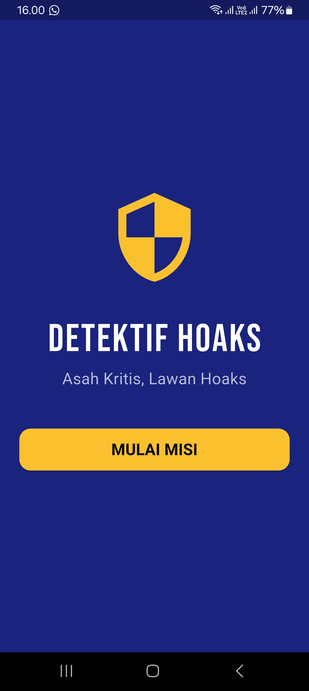
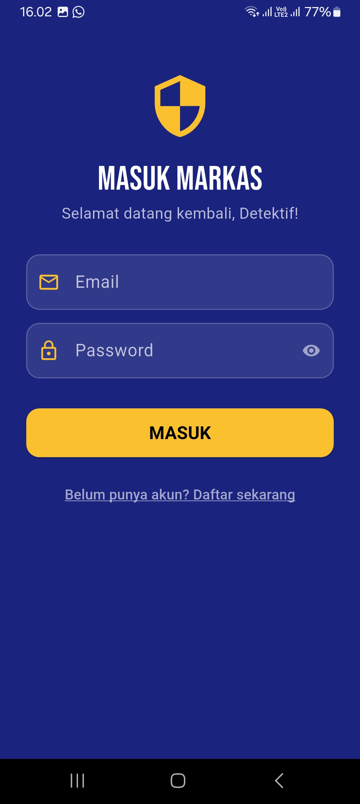
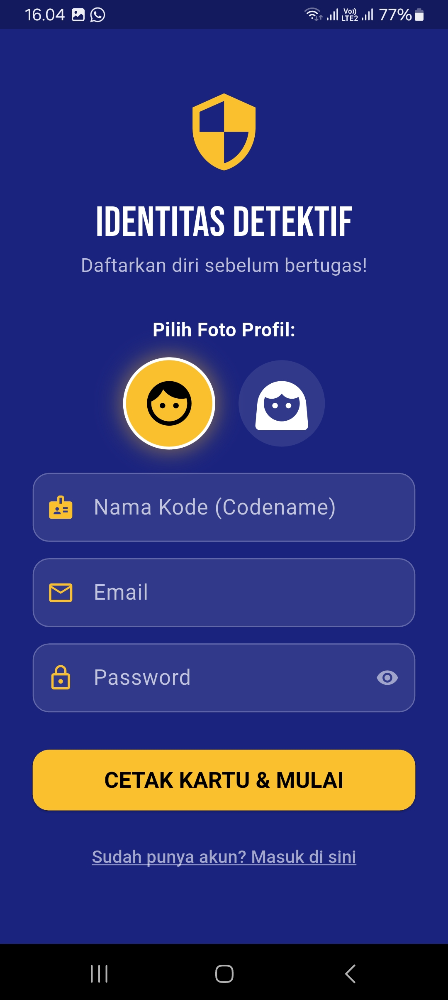
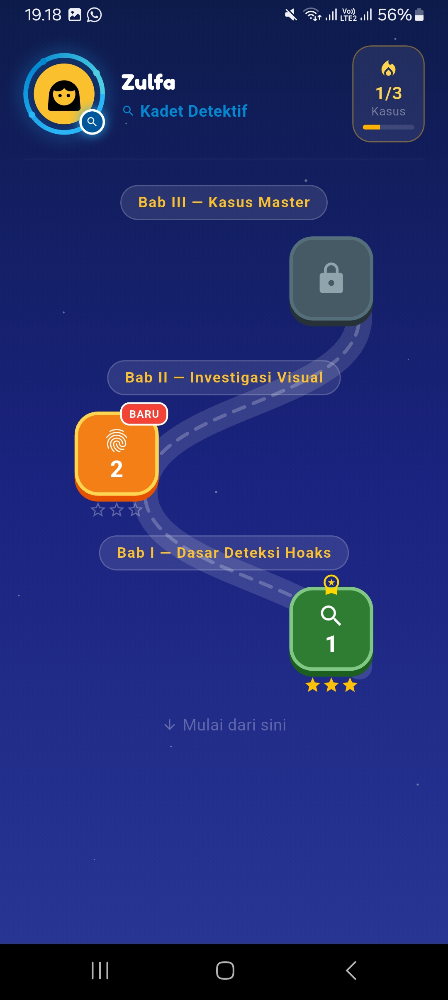
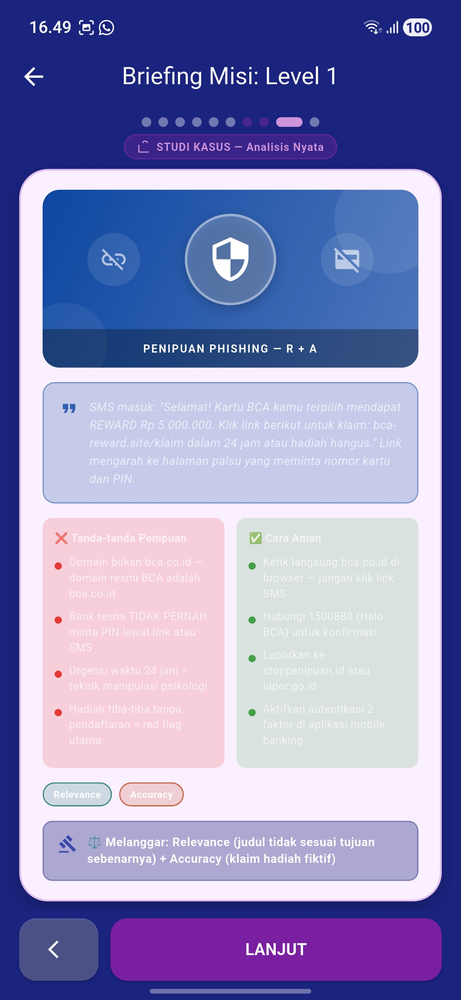
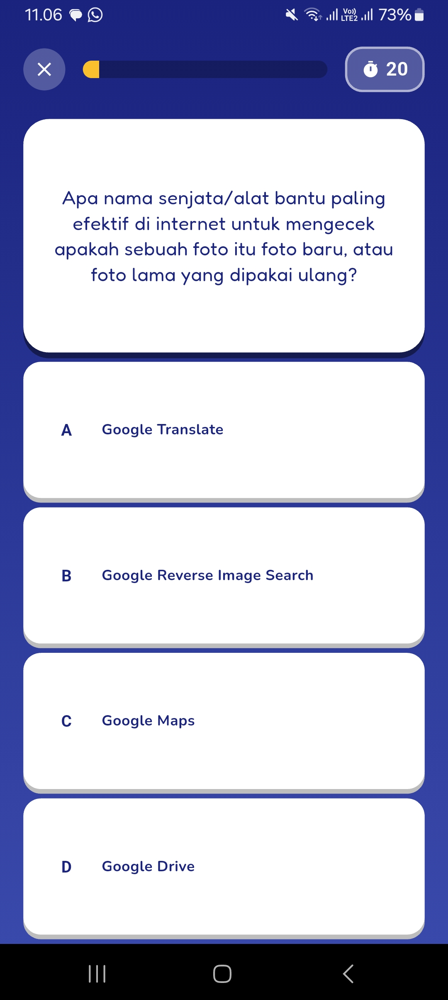
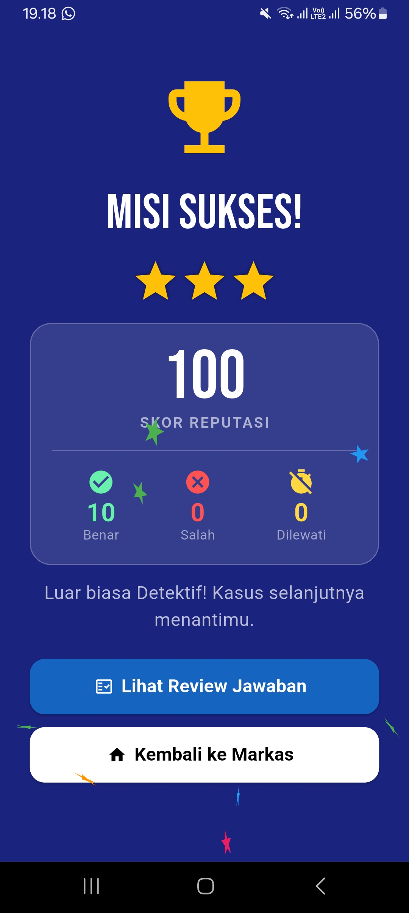
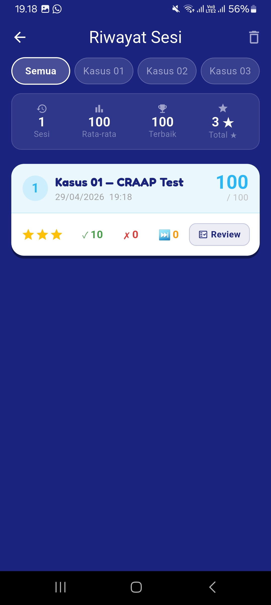
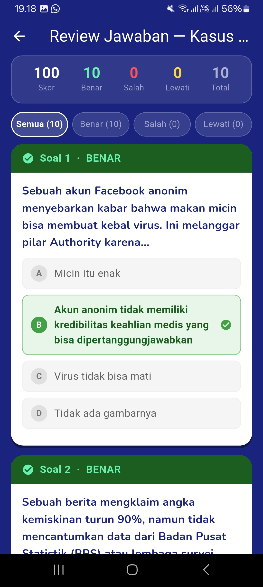
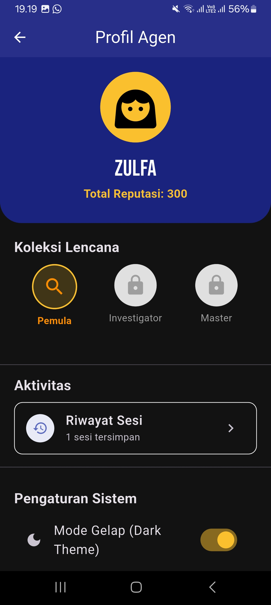

# detektif_hoaks

Detektif Hoaks adalah aplikasi mobile edukatif berbasis gamifikasi yang dirancang untuk meningkatkan literasi digital pengguna, khususnya siswa Sekolah Menengah Atas (SMA), dalam mengenali dan menganalisis informasi hoaks. Aplikasi ini dikembangkan menggunakan framework Flutter dengan Supabase sebagai backend, dan disusun berdasarkan kerangka evaluasi CRAAP (Currency, Relevance, Authority, Accuracy, Purpose) sebagai metode analisis kredibilitas informasi.

Aplikasi menyajikan materi literasi hoaks dalam bentuk konten pembelajaran interaktif serta kuis berbasis skenario yang menantang pengguna untuk mengidentifikasi keaslian suatu berita atau informasi menggunakan prinsip CRAAP. Sistem dilengkapi dengan mekanisme gamifikasi berupa sistem level, pencapaian (achievement), papan peringkat (leaderboard), riwayat aktivitas, umpan balik audio-visual, serta profil pengguna, yang bertujuan meningkatkan motivasi dan keterlibatan pengguna dalam proses pembelajaran.

Fitur utama aplikasi meliputi: autentikasi pengguna, modul materi literasi hoaks, sistem kuis interaktif dengan validasi jawaban, sistem penilaian dan hasil evaluasi, riwayat dan ulasan jawaban, papan peringkat antar pengguna, serta pengaturan aplikasi (audio dan preferensi tampilan). Seluruh data pengguna dan konten dikelola secara real-time melalui basis data Supabase.

# Tampilan Aplikasi

### Preview

  
  
  

  
  
  

  
  
  

  

## Getting Started

This project is a starting point for a Flutter application.

A few resources to get you started if this is your first Flutter project:

- [Lab: Write your first Flutter app](https://docs.flutter.dev/get-started/codelab)
- [Cookbook: Useful Flutter samples](https://docs.flutter.dev/cookbook)

For help getting started with Flutter development, view the
[online documentation](https://docs.flutter.dev/), which offers tutorials,
samples, guidance on mobile development, and a full API reference.
